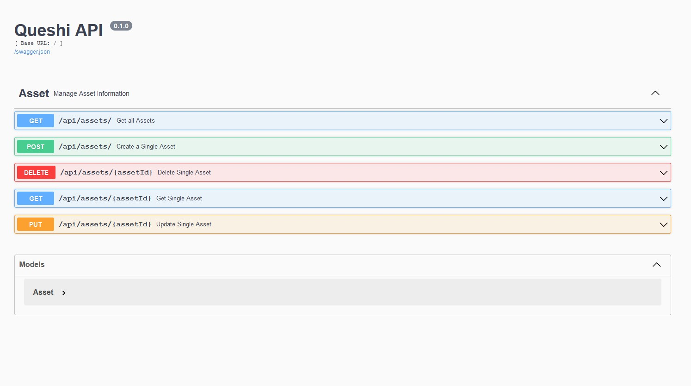

# 1. Settings

## 1.1 Preparing the enviroment
Create a .env file after clone the repository to set a DB_PASSWORD variable

```bash
git clone https://github.com/mullerfs/queshi-server.git
cd queshi-server
echo "DB_PASSWORD=<YOUR_PASSWORD_GOES_HERE>" > .env
```

### Option: Using local enviroment
Create an enviroment for python if you do not intend to use Docker

```bash
python -m venv venv
. ./venv/bin/activate
pip install -r requirements.txt
```

For local enviroment, I do not set the variable FLASK_ENV since the code has  the ``dev`` as default

For local enviroment you must set by yourself a **mysql server**

### Option: Using Docker
If you are using Docker, just run the compose

```
docker-compose up -d --build
```
If you check ``docker-compose.yml`` you will see on service  ``queshi-server`` there is a variable setted for production. Change it for one of those listed on ``./app/config.py``

## The local ``.env``
For security reason, The local env file is on ``.gitignore`` file. You must create one like this:

```bash
cat .env
 DB_PASSWORD="fQ3S83t56DGW"
 FLASK_APP=manage.py
```
## 1.2 Creating database
For creating database use phpmyadmin contained in docker-compose or access it throught cli
```
docker exec -it quehi-db mysql -u root -p
 password: <DB_PASSWORD>
 create database queshi;
```
## 1.3 Creating tables
For creating tables, just use the commands available on ``manage.py``

```
docker exec -it queshi-server flask init_db
```

If you are running a local env:
```
python manage.py init_db
```

# 2 Accessing the Queshi API

Open the browser: http://localhost:5000

You should see the Flask API:



